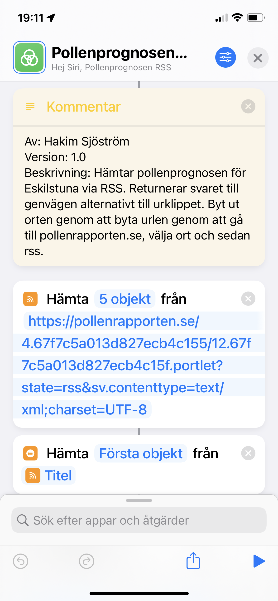

# Dagens pollenprognos

## Beskrivning

Hämtar pollenprognosen för Eskilstuna via RSS. Returnerar svaret till genvägen alternativt till urklippet. Byt ut orten genom att byta url:en genom att gå till pollenrapporten.se, välja ort och sedan rss.

## Användning

Kör genvägen och i klippbordet finns nu prognosen eller kört det från en annan genväg och använd resultatet.

## Skärmbilder

