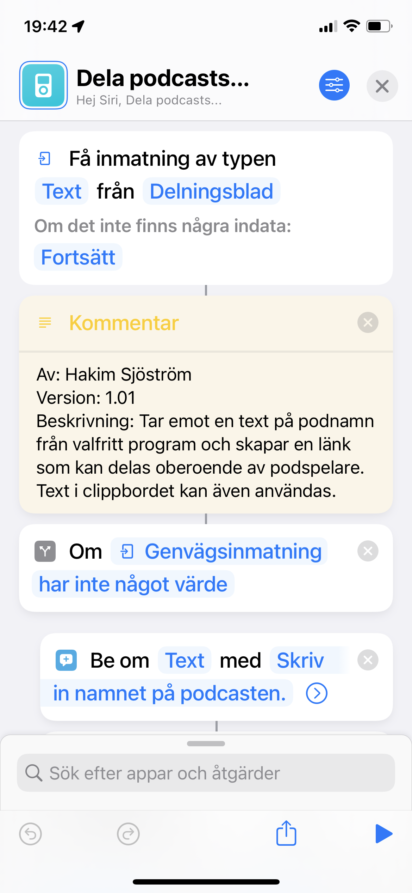
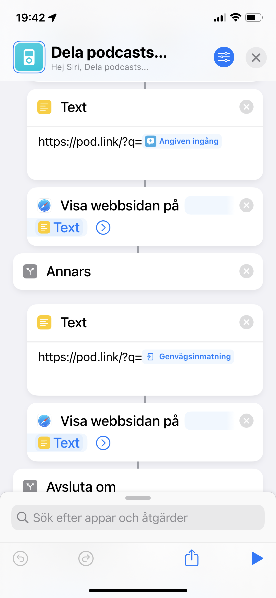

# Dela podcast

## Beskrivning

Tar emot en text på podnamn från valfritt program och skapar en länk som kan delas oberoende av podspelare. Text i clippbordet kan även användas.

## Användning

Markera titeln på podcasten, dela till denna genvägen så skapas en ny länk som kan delas så mottagaren kan själv välja podcastspelare.

## Skärmbilder

## Nerladdning

- [Dela podcast](https://www.icloud.com/shortcuts/f51874092e024adb8872750f347fcb88)
